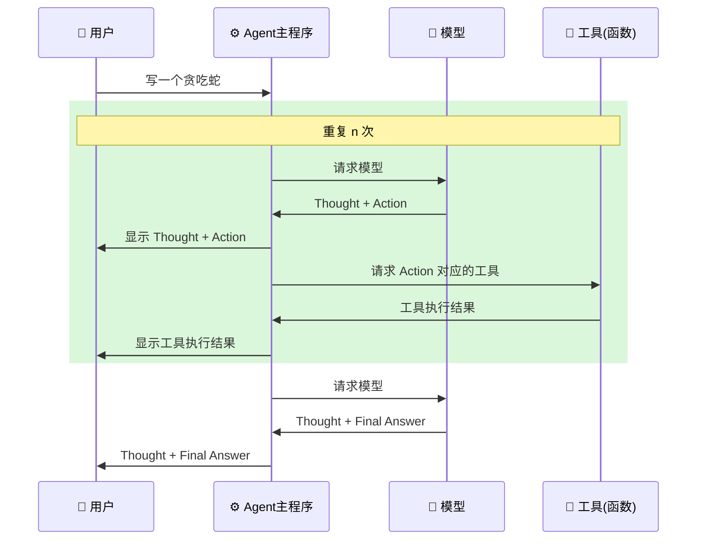
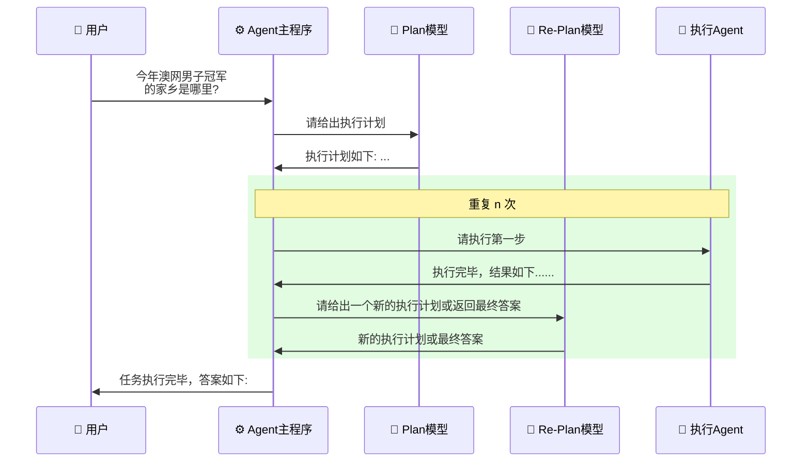

# Agent 的概念、原理与构建模式
## 1. Agent 的基本概念

### 1.1 什么是 Agent

**定义**：Agent（AI Agent）是将大模型与工具组装起来，使其能够感知和改变外界环境的智能程序。

**核心特征**：
- 具备感知外界环境的能力
- 能够改变外界环境
- 可以自主完成任务，实现自动化
- 通常用机器人图标表示（区别于大模型的大脑图标）


### 1.2 大模型的局限性

传统大模型（如 GPT-4o、DeepSeek）存在的问题：
- ❌ **无法感知外界环境**：不能主动查询已有文件、代码等信息
- ❌ **无法改变外界环境**：不能自己写入文件、运行程序等
- ✅ **擅长的方面**：回答问题能力强、逻辑推理能力强


### 1.3 Agent 的解决方案

通过为大模型接入工具（Tools），使其具备：
- 📖 读写文件内容的能力
- 📁 查看文件列表的能力
- ⚙️ 运行终端命令的能力
- 🔍 网络搜索的能力
- 等等...

**工具 = 大模型的感官和四肢**

---


## 2. Agent 的类型与应用

### 2.1 常见 Agent 类型

| Agent 类型 | 应用场景 | 典型代表 |
|-----------|---------|---------|
| 编程类 Agent | 开发程序、代码生成 | Cursor, Claude Code |
| 搜索类 Agent | 深度搜索、信息整合 | Manus |
| 办公类 Agent | 制作 PPT、文档处理 | - |
| 通用类 Agent | 多领域任务处理 | - |


### 2.2 典型案例

**Cursor**

- 用于编程的 Agent
- 用户只需提交任务
- 自动调用大模型和工具写代码
- 用户只需确认，基本无需手动操作


**Manus**

- 深度搜索类 Agent
- 自动生成执行计划
- 搜索并浏览相关网页
- 整理报告并展示给用户


### 2.3 Agent的主要运行模式

**Agent的两大运行模式：**

1. **ReAct**
2. **Plan-and-Execute**


## 3. ReAct 模式详解

### 3.1 ReAct 概述

**全称**：Reasoning and Acting（思考与行动）

**来源**：2022年10月的论文提出，目前使用最广泛的 Agent 运行模式

**核心步骤**：
1. **Thought**（思考）：分析当前情况，决定下一步行动
2. **Action**（行动）：调用工具执行具体操作
3. **Observation**（观察）：查看工具的执行结果
4. **Final Answer**（最终答案）：任务完成后给出结论


### 3.2 ReAct 运行流程


### 3.3 ReAct模式的实现原理-System Prompt

ReAct 模式的实现**主要依赖系统提示词**，而非模型训练。

**System Prompt的一般组成**：

1. **职责描述**（模型角色）

   ```python
   """
   你需要解决一个任务，为此你需要将任务分解为多个步骤。
   对于每个步骤：
   - 首先使用 <thought> 思考要做什么
   - 然后使用 <action> 调用一个工具
   - 工具的执行结果会通过 <observation> 返回给你
   - 持续这个思考和行动的过程
   - 直到你有足够多的信息来提供 <final_answer>
   """
   ```

2. **示例演示**：展示具体的 Thought → Action → Observation → Final Answer 流程

3. **可用工具列表**

   ```bash
   - read_file: 读取文件内容
   - write_to_file: 写入文件内容
   - run_terminal_command: 运行终端命令
   ```

4. **注意事项**：规范工具调用方式、输出格式等

5. **环境信息**

   ```bash
   # 当前操作系统
   # 当前目录
   # 目录下的文件列表
   # 等等
   ```


### 3.4 ReAct 系统提示词案例

```python
react_system_prompt_template = """
你需要解决一个问题。为此，你需要将问题分解为多个步骤。对于每个步骤，首先使用 <thought> 思考要做什么，然后使用可用工具之一决定一个 <action>。接着，你将根据你的行动从环境/工具中收到一个 <observation>。持续这个思考和行动的过程，直到你有足够的信息来提供 <final_answer>。

所有步骤请严格使用以下 XML 标签格式输出：
- <question> 用户问题
- <thought> 思考
- <action> 采取的工具操作
- <observation> 工具或环境返回的结果
- <final_answer> 最终答案

⸻

例子 1:

<question>埃菲尔铁塔有多高？</question>
<thought>我需要找到埃菲尔铁塔的高度。可以使用搜索工具。</thought>
<action>get_height("埃菲尔铁塔")</action>
<observation>埃菲尔铁塔的高度约为330米（包含天线）。</observation>
<thought>搜索结果显示了高度。我已经得到答案了。</thought>
<final_answer>埃菲尔铁塔的高度约为330米。</final_answer>

⸻

例子 2:

<question>帮我找一个简单的番茄炒蛋食谱，并看看家里的冰箱里有没有西红柿。</question>
<thought>这个任务分两步。第一步，找到番茄炒蛋的食谱。第二步，检查冰箱里是否有西红柿。我先用 find_recipe 工具找食谱。</thought>
<action>find_recipe(dish="番茄炒蛋")</action>
<observation>简单的番茄炒蛋食谱：将2个鸡蛋打散，2个番茄切块。热油，先炒鸡蛋，盛出。再热油，炒番茄至软烂，加入鸡蛋，放盐调味即可。</observation>
<thought>好的，我已经有食谱了。食谱需要西红柿。现在我需要用 check_fridge 工具看看冰箱里有没有西红柿。</thought>
<action>check_fridge(item="西红柿")</action>
<observation>冰箱检查结果：有3个西红柿。</observation>
<thought>我找到了食谱，并且确认了冰箱里有西红柿。可以回答问题了。</thought>
<final_answer>简单的番茄炒蛋食谱是：鸡蛋打散，番茄切块。先炒鸡蛋，再炒番茄，混合后加盐调味。冰箱里有3个西红柿。</final_answer>

⸻

请严格遵守：
- 你每次回答都必须包括两个标签，第一个是 <thought>，第二个是 <action> 或 <final_answer>
- 输出 <action> 后立即停止生成，等待真实的 <observation>，擅自生成 <observation> 将导致错误
- 如果 <action> 中的某个工具参数有多行的话，请使用 \n 来表示，如：<action>write_to_file("/tmp/test.txt", "a\nb\nc")</action>
- 工具参数中的文件路径请使用绝对路径，不要只给出一个文件名。比如要写 write_to_file("/tmp/test.txt", "内容")，而不是 write_to_file("test.txt", "内容")

⸻

本次任务可用工具：
${tool_list}

⸻

环境信息：

操作系统：${operating_system}
当前目录下文件列表：${file_list}
"""
```


### 3.5 动手实现一个ReAct Agent (简易版Code Agent)

[简易版ReAct Agent](https://github.com/MarkTechStation/VideoCode/tree/main/Agent%E7%9A%84%E6%A6%82%E5%BF%B5%E3%80%81%E5%8E%9F%E7%90%86%E4%B8%8E%E6%9E%84%E5%BB%BA%E6%A8%A1%E5%BC%8F)


### 3.6 ReAct 完整交互流程




**关键点**：
- 大模型只能**请求调用**工具，不能直接调用
- 真正调用工具的是 Agent 的工具调用组件
- 工具执行结果通过 Observation 返回给模型

---


## 4. Plan-and-Execute 模式详解

### 4.1 模式概述

**核心思想**：先规划再执行（先创建 TODO，再逐步执行）

**来源**：LangChain 提出 [Plan-and-Execute](https://langchain-ai.github.io/langgraph/tutorials/plan-and-execute/plan-and-execute/)

**特点**：

- 引入动态修改规划的环节
- 具有很大的灵活性
- Agent 套 Agent 的设计模式


**Plan-and-Execute 的优势**

1. ✅ **结构清晰**：执行计划一目了然
2. ✅ **动态调整**：可以根据执行结果修改计划
3. ✅ **灵活性强**：执行 Agent 可以是任意类型
4. ✅ **适合复杂任务**：多步骤任务更易管理


### 4.2 组成模块

Plan-and-Execute Agent 包含4个核心模块：

| 模块 | 职责 | 说明 |
|-----|------|------|
| Plan 模型 | 生成初始执行计划 | 根据用户问题制定步骤 |
| Re-Plan 模型 | 动态调整执行计划 | 根据执行结果修改计划或返回答案 |
| 执行 Agent | 执行计划中的每一步 | 可以是 ReAct Agent 或其他类型 |
| Agent 主程序 | 串联整个流程 | 协调各模块工作 |

**注意**：Plan 和 Re-Plan 模型可以是同一个模型


### 4.3 运行流程




### 4.4 实例演示

**用户问题**：今年澳网男子冠军的家乡是哪里？

1. 第一轮执行计划（Plan 1）

   ```bash
   1. 查询当前日期
   2. 查询对应年份的澳网男子冠军名字
   3. 查询该冠军的家乡
   ```

2. 第一轮执行

   - **执行**：查询当前日期 → 结果：2025年
   - **Re-Plan**：生成 Plan 2

3. 第二轮执行计划（Plan 2）

   ```bash
   1. 查询2025年澳网男子冠军名字  ← 更具体了
   2. 查询该冠军的家乡
   ```

4. 第二轮执行

   - **执行**：查询2025年澳网男子冠军 → 结果：XXX
   - **Re-Plan**：生成 Plan 3

5. 第三轮执行计划（Plan 3）

   - 查询 XXX 的家乡

6. 第三轮执行

   - **执行**：查询家乡 → 结果：YYY市
   - **Re-Plan**：所有步骤完成，返回最终答案

7. 最终答案

   ```bash
   2025年澳网男子冠军是 XXX，他的家乡是 YYY市。
   ```


## 5. 两种模式对比

| 对比维度 | ReAct 模式 | Plan-and-Execute 模式 |
|---------|-----------|---------------------|
| **核心思想** | 思考 → 行动 → 观察（循环） | 先规划 → 再执行（可动态调整） |
| **运行流程** | Thought → Action → Observation | Plan → Execute → Re-Plan |
| **适用场景** | 单一目标、直接执行 | 复杂多步骤任务 |
| **灵活性** | 中等 | 高（可动态调整计划） |
| **实现复杂度** | 相对简单 | 较复杂（需要多个模块） |
| **是否嵌套** | 否 | 是（内含执行 Agent） |
| **代表应用** | 简单工具调用场景 | Claude Code, Manus |


## 6. 关键技术要点总结

**系统提示词设计原则**

1. **明确角色定位**：告诉模型它是什么，要做什么
2. **详细流程说明**：通过示例展示完整的工作流程
3. **工具清单**：列出所有可用工具及其用法
4. **规范输出格式**：使用 XML 标签等结构化输出
5. **环境上下文**：提供操作系统、目录等环境信息


**Agent 设计要点**

1. **工具即函数**：每个工具对应一个 Python 函数
2. **模型只能请求**：模型返回工具调用请求，由 Agent 主程序执行
3. **结果反馈循环**：工具执行结果必须返回给模型
4. **安全性考虑**：危险操作（如终端命令）需要用户确认
5. **消息历史管理**：维护完整的对话和执行历史


**实现技巧**

1. **流式 vs 同步返回**

   - **流式返回**：边生成边显示，体验更好，但代码复杂
   - **同步返回**：等待全部生成完成，实现简单

2. **工具调用安全**

   ```python
   if tool_name == "run_terminal_command":
       user_confirm = input("是否执行该命令？(y/n)")
       if user_confirm != 'y':
           return
   ```

3. **消息历史结构**

   ```python
   messages = [
       {"role": "system", "content": system_prompt},
       {"role": "user", "content": user_task},
       {"role": "assistant", "content": "Thought: ... Action: ..."},
       {"role": "user", "content": "Observation: ..."},
       # ... 持续循环
   ]
   ```


Ref：[Agent 的概念、原理与构建模式 —— 从零打造一个简化版的 Claude Code](https://www.youtube.com/watch?v=GE0pFiFJTKo)


