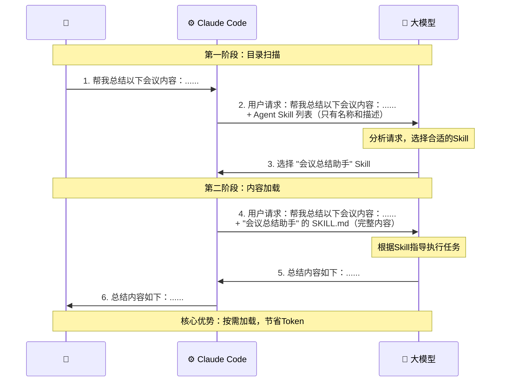

# Agent Skills 从使用到原理

## 1. Agent Skill 是什么

**发展历程:**

- **2025年10月16日**：Anthropic正式推出Agent Skill
  - 初始定位：提升Claude在特定任务上的表现
  - 设计理念：克制但实用

- **快速推广**：行业快速跟进
  - VS Code、Codex、Cursor等工具陆续支持
  - 成为AI Agent领域的事实标准

- **2025年12月18日**：Anthropic重大决定
  - 正式将Agent Skill发布为**开放标准**
  - 支持跨平台、跨产品复用
  - 超越单一产品范畴，成为通用设计模式

----


**核心概念**: 用最通俗的话讲，Agent Skill 就是一个大模型可以随时翻阅的说明文档

**实际应用场景示例**

1. **智能客服场景**
   - 遇到投诉时：先安抚用户情绪
   - 处理原则：不得随意承诺

2. **会议总结场景**
   - 必须按照规定格式输出
   - 包含：参会人员、议题、决定

3. **优势**
   - 无需每次对话重复粘贴长串要求
   - 大模型自行翻阅文档即可知道如何工作

----


**核心价值**

> "Agent Skill 能做的事情要远比说明文档强大"

- 基础层面：作为说明文档使用
- 进阶功能：支持Reference和Script


## 2. Agent Skill 的基本用法

### 2.1 创建 Agent Skill

1. 文件结构要求

   ```bash
   ~/.claude/skills/
   └── 会议总结助手/          # 文件夹名称即为Skill名称
       └── skill.md          # 必需文件
   ```

2. `skill.md` 文件结构

   ```markdown
   ---
   name: 会议总结助手
   description: 用于总结会议录音内容
   ---
   
   # 会议总结指令
   
   ## 任务要求
   你需要总结会议内容，必须包含以下几个方面：
   1. 参会人员
   2. 议题
   3. 决定
   
   ## 输出示例
   **参会人员**：张三、李四
   **议题**：项目进度讨论
   **决定**：下周完成原型设计
   ```

3. 文件组成说明

   **元数据层（Metadata）**

   ```markdown
   ---
   name: 会议总结助手      # 必须与文件夹名称相同
   description: 用于总结会议录音内容  # 向模型说明Skill用途
   ---
   ```

   **指令层（Instruction）**

   - 元数据之后的所有内容
   - 详细描述模型需要遵循的规则
   - 可以包含示例以确保模型理解


### 2.2 使用 Agent Skill

> **使用流程**

1. **打开Claude Code**
   ```bash
   # 查看可用的Skill
   你有哪些Agent Skill？
   ```

2. **发起请求**
   ```
   总结以下会议的内容：
   [粘贴会议录音文本]
   ```

3. **模型响应流程**
   - Claude Code识别请求与某个Skill相关
   - 询问用户是否使用该Skill
   - 用户同意后，读取skill.md文件
   - 根据Skill规则生成结果


> **输出效果**

```markdown
**参会人员**：老陈、小李
**议题**：项目预算讨论
**决定**：批准1200元/晚的酒店预算
```


### 2.3 背后的工作原理

#### Mermaid 数据流图




#### 核心机制：按需加载

**第一阶段：目录扫描**
- 只传递所有Skill的**名称和描述**
- 轻量级，不占用大量Token

**第二阶段：内容加载**
- 仅加载**被选中Skill**的完整内容
- 其他Skill保持未加载状态

**优势**
- 大幅节省Token消耗
- 提升响应速度
- 支持安装多个Skill而不影响性能


## 3. Agent Skill 的高级用法（Reference）

### 3.1 问题场景

> **需求升级：会议总结助手的进阶功能**

**场景描述**

- 基础功能：简单复述会议内容
- 进阶需求：提供有价值的补充说明
  - 涉及花钱时：标注是否符合财务合规
  - 涉及合同时：提示法务风险

**痛点**
- 需要将财务规定、法律条文写入 `skill.md`
- 文件会变得无比臃肿
- 简单早会也要加载大量无关内容
- 严重浪费模型资源


### 3.2 Reference 解决方案

**概念定义**

> Reference 实现"按需中的按需"加载机制

**特性**

- 只有当会议内容涉及特定主题时
- 才会加载相关的Reference文件
- 其他情况下文件保持在硬盘中，不占用Token


### 3.3 实现方法

- 文件结构

  ```bash
  会议总结助手/
  ├── skill.md                    # 主文件
  └── references/
      └── 集团财务手册.md              # Reference文件
  ```

- `references/集团财务手册.md` 内容示例

  ```markdown
  # 集团财务报销标准
  
  ## 住宿费用
  - 标准：500元/晚
  - 超标需审批
  
  ## 餐饮费用
  - 标准：300元/人/天
  - 超标需审批
  ```

- `skill.md` 中的触发规则

  ```markdown
  ---
  name: 会议总结助手
  description: 用于总结会议录音内容
  ---
  
  # 基本规则
  [之前的规则...]
  
  # 财务提醒规则
  **触发条件**：仅在提到钱、预算、采购、费用时触发
  
  **处理逻辑**：
  1. 读取 `集团财务手册.md` 文件
  2. 根据手册内容检查会议决定中的金额是否超标
  3. 明确标注审批人要求
  ```

  


### 3.4 实际运行效果

#### 测试场景

**会议内容**：老陈让小李订1200元/晚的酒店

**Claude Code 执行流程**
1. 识别请求与"会议总结助手"相关 → 请求使用Skill ✓
2. 发现会议涉及钱 → 请求读取 `references/集团财务手册.md` ✓
3. 综合信息生成总结

**输出结果**

```
**参会人员**：老陈、小李
**议题**：商务出差安排
**决定**：预订1200元/晚酒店

⚠️ **财务提醒**：
- 标准：500元/晚
- 实际：1200元/晚
- 状态：超标700元
- 需要：部门经理审批
```


#### 对比场景：技术复盘会

**会议内容**：纯技术讨论，不涉及预算

**Claude Code 行为**
- ✅ 使用会议总结助手Skill
- ❌ 不读取 `references/集团财务手册.md`
- ✅ 输出基本总结（无财务提醒）


### 3.5 Reference 核心特性总结

| 特性 | 说明 |
|-----|-----|
| **加载方式** | 条件触发 |
| **触发时机** | 读取skill.md后，判断需要时才加载 |
| **Token消耗** | 仅在触发时消耗 |
| **典型用途** | 规章制度、参考文档、数据字典 |


## 4. Agent Skill 的高级用法（Script）

### 4.1 问题场景

> "查资料只是第一步，能直接动手运行代码帮我们把活干了，这才是真正的自动化"

**需求**：会议总结完成后，自动上传到服务器


### 4.2 Script 实现

1. 文件结构

   ```bash
   会议总结助手/
   ├── skill.md                    # 主文件
   ├── references/
   │   └── 集团财务手册.md              # Reference
   └── scripts/
       └── upload.py                   # Script文件
   ```

2. `scripts/upload.py` 示例

   ```python
   #!/usr/bin/env python3
   import requests
   import json
   from datetime import datetime
   
   def upload_summary(content):
       """上传会议总结到服务器"""
       url = "https://api.example.com/meeting-summary"
       
       payload = {
           "content": content,
           "timestamp": datetime.now().isoformat(),
           "source": "claude-code"
       }
       
       response = requests.post(url, json=payload)
       
       if response.status_code == 200:
           print(f"✓ 上传成功")
           print(f"文档ID: {response.json()['id']}")
       else:
           print(f"✗ 上传失败: {response.status_code}")
   
   if __name__ == "__main__":
       # Claude Code会传入参数
       import sys
       if len(sys.argv) > 1:
           upload_summary(sys.argv[1])
   ```

3. `skill.md` 中的上传规则

   ```markdown
   # 上传规则
   **触发条件**：用户提到"上传"、"同步"或"发送到服务器"
   
   **处理逻辑**：
   1. 生成会议总结
   2. 运行 `upload.py` 脚本
   3. 将总结内容上传到服务器
   4. 返回上传状态
   ```


### 4.3 实际运行效果

1. 用户请求

   ```bash
   总结下这个会议的内容，并把它上传到服务器中
   [粘贴会议内容]
   ```

2. Claude Code 执行流程

   1. 识别使用"会议总结助手" ✓
   2. 生成会议总结
   3. 检测到"上传"关键词
   4. 请求执行 `upload.py` 脚本 ✓
   5. 显示上传结果

3. 输出结果

   ```markdown
   **参会人员**：张三、李四
   **议题**：季度规划
   **决定**：Q2启动新项目
   
   ---
   ✓ 上传成功
   文档ID: MS-2026-0131-001
   服务器时间: 2026-01-31 14:23:45
   ```


### 4.4 Script 核心特性

> 关键差异：执行 vs 读取

**重要特性**
- Script 只会被**执行**，不会被**读取**
- Claude Code 不关心脚本内容
- 只关心：运行方法 + 运行结果

**优势**
- 哪怕脚本有1万行复杂业务逻辑
- 消耗的模型上下文几乎为零
- Token效率极高

----


> 注意事项

⚠️ **特殊情况**
- 如果没有明确说明执行方法
- Claude Code 可能会读取代码以理解如何运行
- 此时会占用上下文Token

✅ **最佳实践**
- 在skill.md中清楚描述脚本的运行方法
- 说明输入参数和预期输出
- 避免让模型猜测如何使用脚本


### 4.5 Reference vs Script 对比

| 维度 | Reference | Script |
|-----|-----------|--------|
| **本质** | 数据文件 | 可执行代码 |
| **处理方式** | 读取内容 | 执行运行 |
| **上下文消耗** | ✓ 会消耗Token | ✗ 几乎不消耗 |
| **典型用途** | 规章制度、参考文档 | 自动化任务、数据处理 |
| **加载时机** | 条件触发时读取 | 条件触发时执行 |


## 5. 渐进式披露机制

### 5.1 核心设计理念

> Agent Skill 是一个精密的**渐进式披露结构**

**设计目标**
- 最小化不必要的上下文消耗
- 按需逐层加载信息
- 提升整体执行效率


### 5.2 三层架构


### 5.4 实际运行案例

> 场景1：涉及财务的会议

```
用户请求："总结会议，老陈批准1200元/晚酒店"
         ↓
【第一层】扫描所有Skill元数据
         → 匹配"会议总结助手"
         ↓
【第二层】加载 skill.md 完整内容
         → 检测到"1200元" → 触发财务规则
         ↓
【第三层】读取 集团财务手册.md
         → 判断超标情况
         ↓
输出结果：基本总结 + 财务提醒
```
----


> 场景2：不涉及财务的技术会议

```
用户请求："总结技术复盘会议"
         ↓
【第一层】扫描所有Skill元数据
         → 匹配"会议总结助手"
         ↓
【第二层】加载 skill.md 完整内容
         → 未检测到财务相关关键词
         ↓
【第三层】不加载任何资源
         ↓
输出结果：仅基本总结
```


### 5.5 Token消耗对比

> 传统方式（全量加载）

```
每次请求都加载：
- Skill说明：2000 tokens
- 财务手册：5000 tokens
- 法律条文：8000 tokens
- 上传脚本：1000 tokens
总计：16000 tokens / 请求
```

----


> 渐进式披露（智能加载）

```
技术会议：
- 元数据层：500 tokens
- 指令层：2000 tokens
- 资源层：0 tokens
总计：2500 tokens / 请求（节省85%）

财务会议：
- 元数据层：500 tokens
- 指令层：2000 tokens
- 资源层：5000 tokens
总计：7500 tokens / 请求（节省53%）
```


## 6. Agent Skill vs MCP

### 6.1 官方定位

**Anthropic官方核心观点**

> **MCP connects Claude to data**
> 
> **Skills teach Claude what to do with that data**

翻译：
- **MCP**：给大模型供给数据
- **Skills**：教会大模型如何处理这些数据


### 6.2 本质差异

| 维度           | MCP            | Agent Skill       |
| -------------- | -------------- | ----------------- |
| **本质**       | 独立运行的程序 | 说明文档          |
| **运行方式**   | 独立进程       | 集成在Skill系统中 |
| **安全性**     | 高（独立沙箱） | 中（脚本执行）    |
| **稳定性**     | 高（标准协议） | 中（依赖环境）    |
| **适用场景**   | 复杂数据连接   | 轻量脚本处理      |
| **代码复杂度** | 支持复杂逻辑   | 适合简单逻辑      |


### 6.3 常见疑问解答

**疑问**
> Agent Skill能否替代MCP？ "Agent Skill里面也能写代码，直接在Skill里写连接数据的逻辑不就好了吗？"


**解答**

✅ **能干**：Agent Skill确实能连接数据
❌ **不适合**：能干不代表适合干

**类比说明**

```
瑞士军刀也能切菜，但没有人会用它来替代菜刀
- 瑞士军刀：多功能，但每个功能都不专业
- 菜刀：专业工具，专注做好一件事

Agent Skill：多功能，适合轻量任务
MCP：专业工具，专注数据连接
```


### 6.4 选择指南

#### 使用 MCP 的场景

✅ **推荐使用MCP**
- 需要稳定的数据库连接
- 需要调用复杂的API
- 需要处理敏感数据
- 需要长期运行的服务
- 需要高安全性保障

**示例**
```python
# 适合用MCP实现
- 连接企业数据库查询销售数据
- 集成第三方支付系统
- 实时监控系统状态
- 复杂的数据ETL流程
```


#### 使用 Agent Skill 的场景

✅ **推荐使用Agent Skill**
- 定义处理规则和流程
- 执行轻量级脚本
- 格式化输出要求
- 条件触发的简单任务

**示例**

```python
# 适合用Agent Skill实现
- 会议总结格式要求
- 简单的文件上传
- 数据格式转换
- 基于规则的判断逻辑
```


#### 组合使用模式

**最佳实践**：结合使用，发挥各自优势

```
场景：智能报销助手

┌─────────────────────────────────────┐
│  Agent Skill: 报销流程规则            │
│  - 定义审批流程                       │
│  - 规定格式要求                       │
│  - 设置金额检查规则                   │
└─────────────────────────────────────┘
              ↓
┌─────────────────────────────────────┐
│  MCP: 数据连接服务                    │
│  - 连接财务系统                       │
│  - 查询历史报销记录                   │
│  - 提交审批工单                       │
└─────────────────────────────────────┘
```

**工作流程**

1. **Agent Skill** 定义：报销金额超过5000需要特批
2. **MCP** 查询：该员工历史报销记录
3. **Agent Skill** 判断：是否符合规则
4. **MCP** 执行：提交到相应的审批流程
5. **Agent Skill** 输出：格式化的审批结果


## 总结

Agent Skill作为Anthropic推出并开放的标准，正在成为AI Agent领域的重要设计模式。其核心优势在于：

1. **渐进式披露机制**：三层架构最大化节省Token
2. **灵活的扩展能力**：通过Reference和Script支持复杂场景
3. **简单的使用方式**：本质是说明文档，易于理解和创建
4. **与MCP互补**：各司其职，组合使用效果更佳

随着跨平台支持的完善，Agent Skill将在更多场景中发挥重要作用。


## 参考资源

- [Anthropic Agent Skill 官方文档](https://docs.anthropic.com)
- [Agent Skill 从使用到原理，一次讲清](https://www.youtube.com/watch?v=yDc0_8emz7M)
- [MCP vs Skills 官方对比文章](https://www.anthropic.com/mcp-vs-skills)


