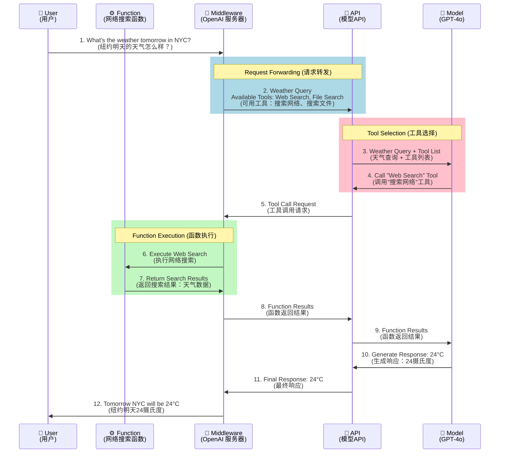
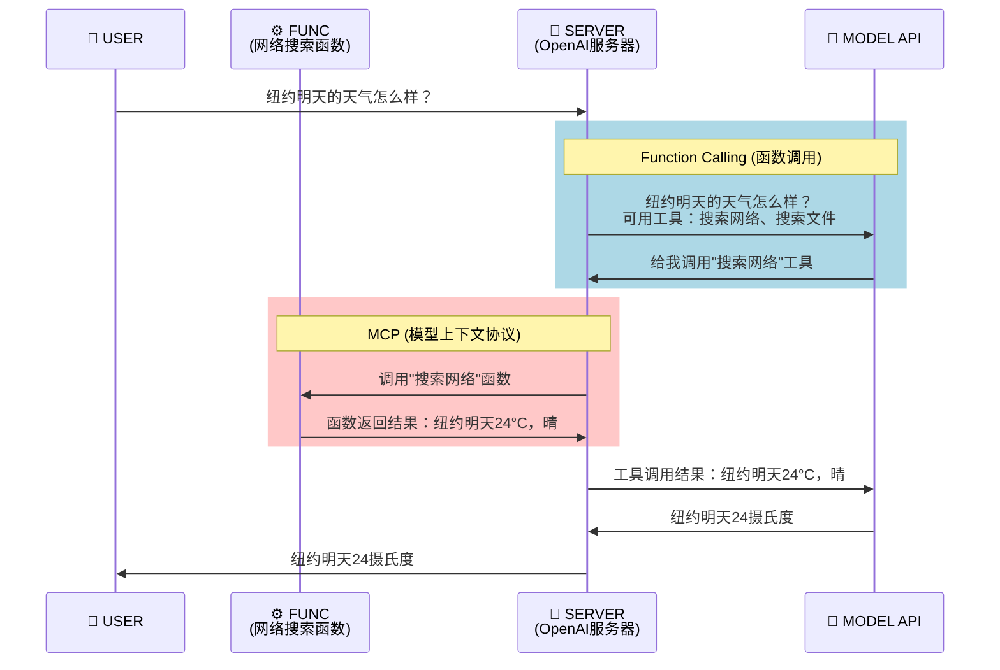

# Function Calling 详解

## 什么是 Function Calling

> **核心概念**

**Function Calling（函数调用）** 是大语言模型（LLM）的一项重要能力，它允许模型在回答用户问题时，能够智能地调用外部函数或工具来获取实时数据、执行特定操作或访问外部资源。


> **工作原理**

如上图所示，Function Calling 的工作流程包含三个关键组件：

1. **大语言模型**：负责理解用户意图，判断是否需要调用外部函数，并解析函数返回的结果
2. **中间人/应用层**：作为桥梁，接收模型的函数调用请求，实际执行函数，并将结果返回给模型
3. **函数仓库**：包含各种可调用的函数和外部资源，如：
   - 代码函数（计算、数据处理等）
   - 文档和知识库
   - 云存储服务
   - 邮件服务
   - API 接口等


## Function Calling 链路分析

### Function Calling的数据流




### Function Calling和MCP分别作用的环节




## Function Calling 协议内容分析

Function Calling 的完整交互涉及**两次模型调用**，下面以 JSON 数据流的形式展示整个过程。

### 步骤 0

> **工具定义**

 首先定义可用的工具（遵循 JSON Schema 格式）：

```json
{
  "tools": [
    {
      "type": "function",
      "function": {
        "name": "search",
        "description": "搜索网络",
        "parameters": {
          "type": "object",
          "properties": {
            "query": {
              "type": "string",
              "description": "要搜索的内容"
            }
          },
          "required": ["query"]
        }
      }
    }
  ]
}
```


### 步骤 1

> **第一次请求**（用户提问 → 模型）:

**请求体：**

```json
{
  "model": "gpt-4o-mini",
  "messages": [
    {
      "role": "user",
      "content": "纽约明天的天气怎么样？"
    }
  ],
  "tools": [
    {
      "type": "function",
      "function": {
        "name": "search",
        "description": "搜索网络",
        "parameters": {
          "type": "object",
          "properties": {
            "query": {"type": "string", "description": "要搜索的内容"}
          },
          "required": ["query"]
        }
      }
    }
  ]
}
```


### 步骤 2

> **第一次响应（模型返回工具调用）**

**响应体：**

```json
{
  "choices": [
    {
      "message": {
        "role": "assistant",
        "content": null,
        "tool_calls": [
          {
            "id": "call_abc123",
            "type": "function",
            "function": {
              "name": "search",
              "arguments": "{\"query\": \"纽约明天天气\"}"
            }
          }
        ]
      }
    }
  ]
}
```

**关键信息：**
- `tool_calls`: 模型请求调用的工具列表
- `id`: 工具调用的唯一标识符
- `function.name`: 要调用的函数名
- `function.arguments`: JSON 字符串格式的参数


### 步骤 3

> **执行工具（中间人本地执行）**

**解析参数并执行：**
```python
tool_name = "search"
tool_args = {"query": "纽约明天天气"}
result = execute_tool(tool_name, tool_args)  # 返回: "纽约市今天的天气是晴天，明天的天气是多云。"
```

**构造工具结果消息：**

```json
{
  "role": "tool",
  "tool_call_id": "call_abc123",
  "name": "search",
  "content": "纽约市今天的天气是晴天，明天的天气是多云。"
}
```


### 步骤 4

> **第二次请求（工具结果 → 模型）**

**请求体（包含完整对话历史）：**
```json
{
  "model": "gpt-4o-mini",
  "messages": [
    {
      "role": "user",
      "content": "纽约明天的天气怎么样？"
    },
    {
      "role": "assistant",
      "content": null,
      "tool_calls": [
        {
          "id": "call_abc123",
          "type": "function",
          "function": {
            "name": "search",
            "arguments": "{\"query\": \"纽约明天天气\"}"
          }
        }
      ]
    },
    {
      "role": "tool",
      "tool_call_id": "call_abc123",
      "name": "search",
      "content": "纽约市今天的天气是晴天，明天的天气是多云。"
    }
  ],
  "tools": [...]
}
```


### 步骤 5

> **第二次响应（模型生成最终回复）**

**响应体：**

```json
{
  "choices": [
    {
      "message": {
        "role": "assistant",
        "content": "根据查询结果，纽约明天的天气是多云。"
      }
    }
  ]
}
```


### JSON 数据流总览

```
👤 用户
  ↓ 
  📤 Request 1: {"messages": [{"role": "user", "content": "纽约天气?"}], "tools": [...]}
  ↓
🤖 模型
  ↓
  📥 Response 1: {"tool_calls": [{"function": {"name": "search", "arguments": "..."}}]}
  ↓
⚙️  本地执行工具
  ↓
  📤 Request 2: {"messages": [..., {"role": "tool", "content": "搜索结果"}], "tools": [...]}
  ↓
🤖 模型
  ↓
  📥 Response 2: {"message": {"content": "明天多云"}}
  ↓
👤 用户
```

**核心要点：**
1. **第一次调用**：模型判断需要调用哪个工具及参数
2. **中间执行**：本地/服务端执行工具，获取结果
3. **第二次调用**：将工具结果发回模型，生成最终用户回复
4. **关键字段**：`tool_calls`（模型请求）、`role: "tool"`（工具结果）、`tool_call_id`（关联标识）


## 参考

- [MCP 与 Function Calling 到底什么关系 —— 以及为什么我认为大部分人的观点都是错误的](https://www.youtube.com/watch?v=BT5tPe9dcpU)
- [MCP 与 Function Calling 到底什么关系（Source Code）](https://github.com/MarkTechStation/VideoCode/tree/main)


